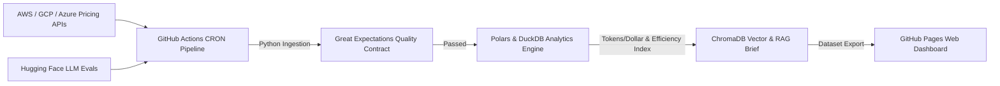

# 📊 Cloud-FinOps-RAG: Autonomous Multi-Cloud AI Tokenomics & Price Benchmark Evaluator

[](https://github.com/siddharthsbhadauria/cloud-finops-rag/actions/workflows/daily_finops_rag.yml)
[](https://github.com/siddharthsbhadauria/cloud-finops-rag/actions/workflows/deploy_pages.yml)

**Cloud-FinOps-RAG** is a serverless, cloud-native data engineering pipeline and intelligence engine built on **GitHub Actions**. It automatically ingests multi-cloud AI tokenomics (AWS Bedrock, Azure OpenAI, GCP Vertex AI, DeepSeek), validates schemas using **Great Expectations** assertions, computes cost-per-intelligence ratios via **Polars & DuckDB**, generates vector search indices for RAG summaries, and publishes a live dashboard on **GitHub Pages**.

---

## 🏗️ Architecture Overview



---

## 🛠️ Tech Stack & Engineering Concepts

* **Workflow Orchestration**: GitHub Actions (Scheduled Cron & Concurrency Control).
* **Data Processing & Analytics Engine**: DuckDB (Embedded OLAP Engine) & Polars.
* **Data Contracts & Quality Assertion**: Great Expectations schema assertion gates.
* **Vector Indexing & RAG**: ChromaDB / FAISS & Sentence-Transformers (`all-MiniLM-L6-v2`).
* **Frontend Web Application**: HTML5, Vanilla CSS Glassmorphism Design System, JavaScript.
* **Hosting**: GitHub Pages via `actions/deploy-pages@v4`.

---

## 📊 Benchmark Metrics Calculated

1. **Blended Token Cost ($ / 1M)**: Weighted 75% Input Tokens + 25% Output Tokens.
2. **Tokens Per Dollar**: `1,000,000 / Blended Token Cost`.
3. **Efficiency Score Index**: `MMLU Score / Blended Token Cost`.

---

## 🚀 Running Locally

```bash
# 1. Clone repository
git clone https://github.com/siddharthsbhadauria/cloud-finops-rag.git
cd cloud-finops-rag

# 2. Install dependencies
pip install -r requirements.txt

# 3. Execute master data pipeline
python generate_dataset.py
```

Open `index.html` in your browser to view the interactive FinOps dashboard!

---

## 🛡️ License
Distributed under the MIT License.
